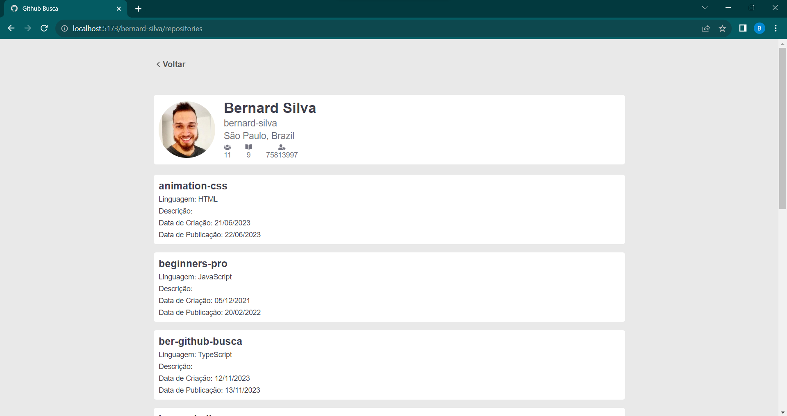

# Challenge: GitHub Search

<h6> Não fala inglês? <a href="https://github.com/bernard-silva/github-busca-react-ts#readme-pt-br">Clique aqui</a> para ver essa página em português.<h6>
</br>

**Challenge Objective**: Implement a search page that brings user data from GitHub and when clicking on the photo returns more details and a list of your repositories, where when tapping on one of them you should be directed to the repository on the GitHub website . Also display a menu with the history of searched users.

### Preview

<p align="center">
  
  
</p>

### Tools used

- <a href="https://axios-http.com/" target="_blank">ReactJS (com Vite)</a>
- <a href="https://tailwindcss.com/" target="_blank">TypeScript</a>
- <a href="https://react.dev/" target="_blank">Axios</a>
- <a href="https://tanstack.com/" target="_blank">Styled Components</a>

### Why the tools?

- **TypeScript**: Using React with _TypeScript_ it is possible to receive error alerts during development, allowing errors to be minimized and corrected before execution or build.
  Using the VsCode IDE it is possible to enhance this experience, as it was developed with TypeScript and considerably improves the return of alerts.
- **Customizable styling**: _Styled Components_
  allows you to write CSS styles inside JavaScript, turning them into components and
  improving code architecture and maintenance.
- **API consumption**: with axios we make HTTP requests in applications
  web, offering advanced features for efficient communication with
  servers.

### Installation and how to perform

> You need to have the data manager
> packages/dependencies <a href="https://classic.yarnpkg.com/" target="_blank">yarn</a> in
> your machine

```
git clone https://github.com/bernard-silva/github-busca-react-ts.git && cd github-busca-react-ts
```

- Navigate to the project root
- Install dependencies with `yarn install`
- Run the project with `yarn dev`
- Access the URL generated by Vite
